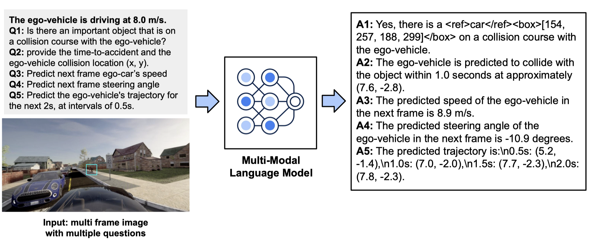

# CSPPR
Critical Scenario Prediction Planning and Reasoning (CSPPR)

 

  

  <h3 align="center"></h3>

  

    TB-Bench: Training and Testing Multi-Modal AI for Understanding Spatio-Temporal Traffic Behaviors from Dashcam Images/Videos
     
    <a href=""><strong>Paper</strong></a> <strong>|</strong>
    <a href=""><strong>Benchmark Dataset</strong></a> <strong>|</strong>
    <a href="https://huggingface.co/datasets/megadarkparticle/CSPPR"><strong>Training Dataset</strong></a> <strong>|</strong>
     
  

